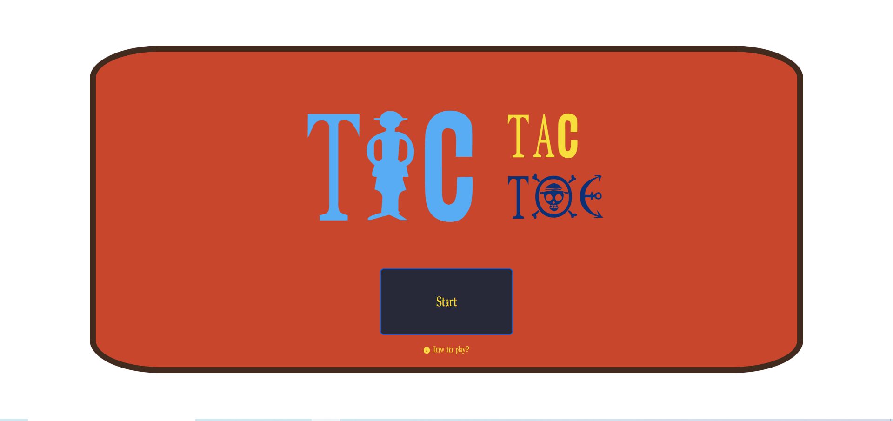
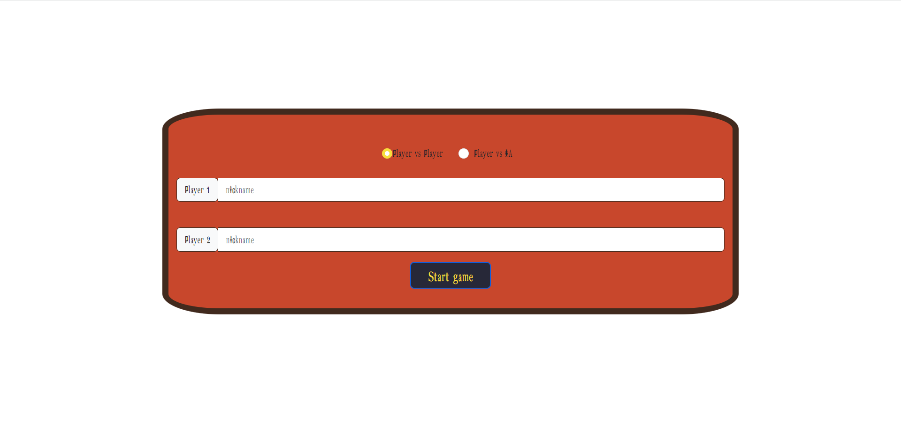
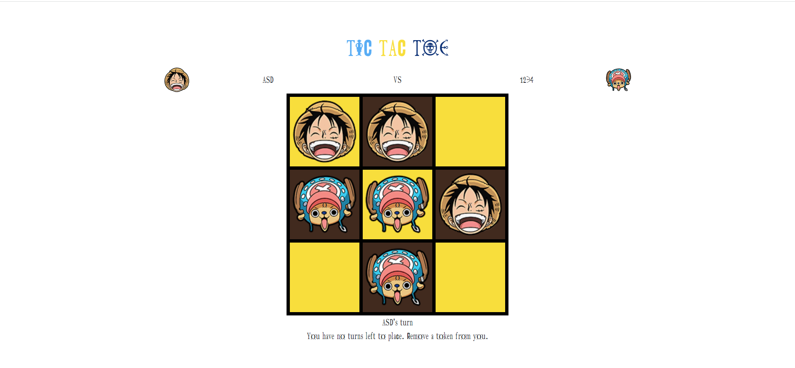
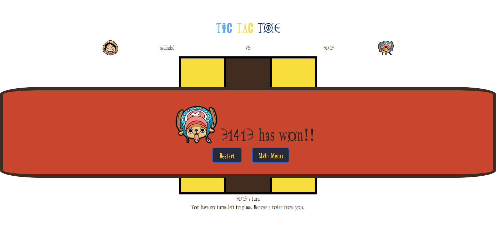

# TIC TAC TOE

You can deploy my project here: https://joserr98.github.io/TicTacToe/

## Languages used

### Index

gi
### Players selection

Here is the players selection, you can play against another person or vs IA (easy mode)

### Game

### Winning

### Contáctame:

  Jose Manuel Ruiz Ruiz
